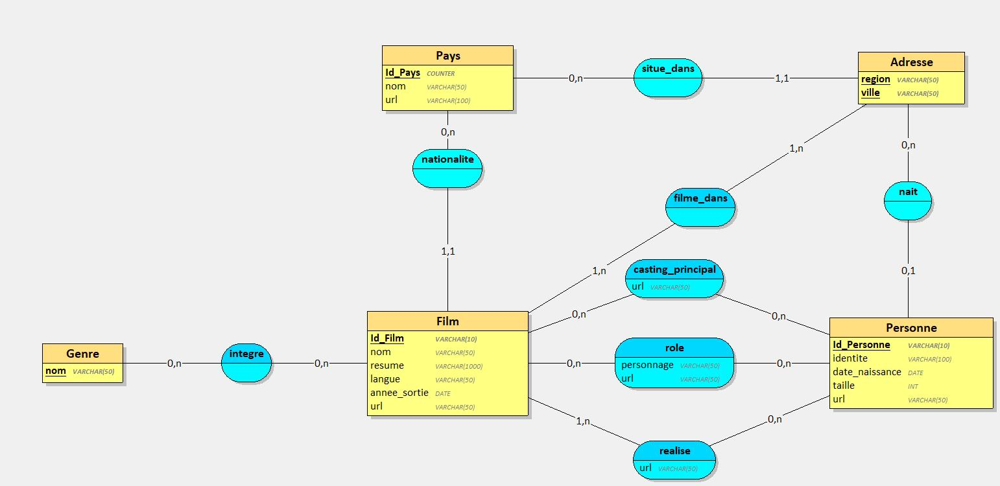
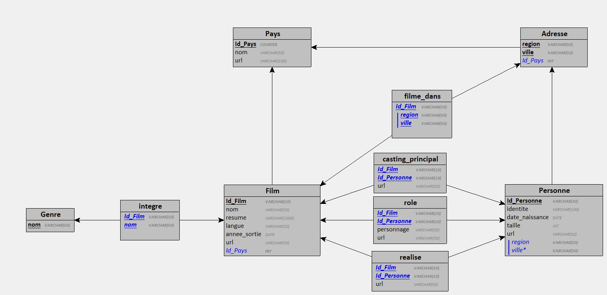

# MOVIES IMDb DATABASE
Projet de conception et développement d'une application console de création et requêtage d'une base de données.

## SOMMAIRE
1. [Contexte](#contexte)
2. [Conception](#conception)
3. [Fonctionnement](#fonctionnement)\
    3.1. [Parsing du JSON et mapping des données]\
    3.2. Création des entités\
    3.3. Application de requêtage\
4. [Pré-requis](#pré-requis)\
    4.1. [Dépendances](#dépendances)\
    4.2. [Installation](#installation)\
    4.3. [Configuration](#configuration)
5. [Collaborateurs du projet](#collaborateurs)

## 1. Contexte
A partir d'un fichier JSON contenant des informations sur des films, nous devons extraire ces données, les écrire en base de données et permettre le requêtage.

## 2. Conception

Modèle conceptuel de Données (MCD) :

Unified Modeling Language (UML) :

Modèle Logique de Données (MLD) :

Diagramme de classe :

## 3. Fonctionnement
### 3.1. Parsing et mapping

### 3.2. Création des entités

### 3.3. Application de requêtage

Menu basique sous terminal de commande, qui s'exécute avec la classe "Traitement".

Le menu est utilisé en deux temps avec deux types d'input :
- un premier input pour choisir quel type de cherche à faire dans la base de données, avec un choix de 6 options + 1 choix pour quitter le menu.
- un second input pour rentrer les paramètres de recherche relatifs au choix (en fonction du choix peut-être "nom d'actreur/actrice", "nom film" ou "date")
Les paramètres sont ensuite utilisés par la méthode, appelés de la classe "QuerysMenu", qui correspond au choix fait dans le premier input. Elle fait le requêtage correspondant à la base de données et renvoie les données à la classe "Traitement" qui les affiche.

Le code est fonctionnel mais pas très DRY ni très optimisé.
Manque aussi peut-être d'un menu sur-jacent qui permet en une seul classe exécutable d'utilisé le remplissage (classe "Remplissage") de la base de données et la recherche (classe "Traitement").

On note que les inputs de "nom d'acteur/actice" et de "nom de film" sont de type sting (pour les choix 1, 2, 4, 5 et 6). Ici, elles sont sensibles aux espaces en trop et aux fautes d'orthographe. De façon générale, les inputs entrés doivent être strictement égaux au nommage dans la base de données (à la colonne IDENTITE de la table personne pour le nom d'acteur/actice ; à la colonne NOM de la table film pour "nom de film").

## 4. Collaborateurs
Camarades de classe dans la promotion Concepteur Développeur d'Applications dispensé par Diginamic, une belle collaboration est née autour de ce projet.

- [Abel Correia](#https://github.com/Erico-Labare)
- [Arnaud Clavier](#https://github.com/Arnaud-C18)
- [Johan Guillen](#https://github.com/sioupe)
- [Pauline Bouyssou](#https://github.com/popobg)
