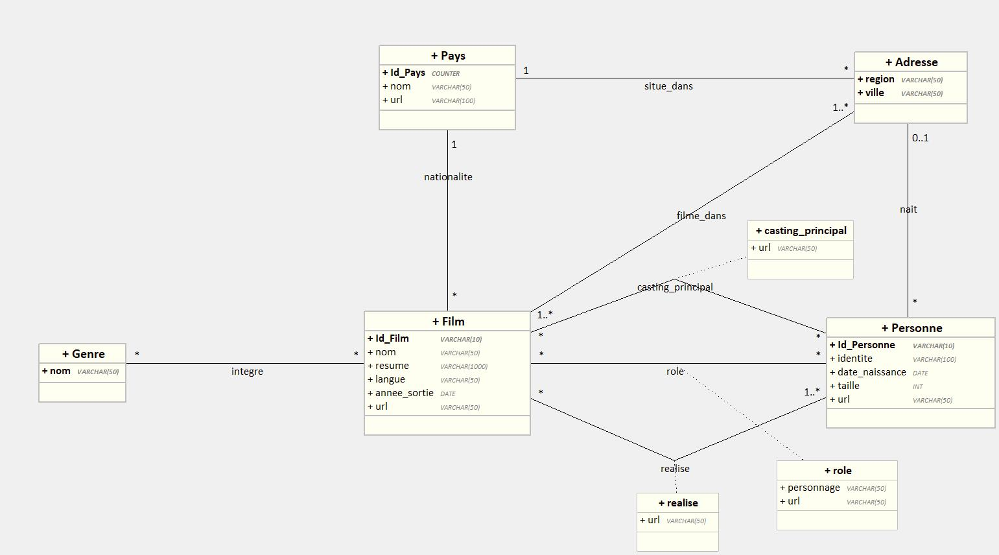

# MOVIES IMDb DATABASE
Projet de conception et développement d'une application console de création et requêtage d'une base de données.

## SOMMAIRE
1. [Contexte](#1-Contexte)
2. [Conception](#2-Conception)
3. [Fonctionnement](#3-Fonctionnement)\
    3.1. [Parsing du JSON et mapping des données](#31-Parsing-et-mapping)\
    3.2. [Création des entités](#32-Création-des-entités)\
    3.3. [Application de requêtage](#33-Application-de-requêtage)
4. [Pré-requis](#4-Pré-requis)\
    4.1. [Dépendances](#41-Dépendances)\
    4.2. [Installation](#42-Installation)\
    4.3. [Configuration](#43-Configuration)
5. [Collaborateurs du projet](#5-Collaborateurs)

## 1. Contexte
A partir d'un fichier JSON contenant des informations sur des films, nous devons extraire ces données, les écrire en base de données et permettre le requêtage.

## 2. Conception

Modèle conceptuel de Données (MCD) :

Unified Modeling Language (UML) :

Modèle Logique de Données (MLD) :

Diagramme de classe :

## 3. Fonctionnement
### 3.1. Parsing et mapping
### Récupération du fichier de données
Au lancement du programme de création de la base de données ([classe Remplissage](src/main/java/fr/digi/cda2024/ihm/Remplissage.java)), la console demande à l'utilisateur de lui communiquer le chemin vers son fichier json contenant les données du film.\
Il est recommandé d'utiliser le chemin absolu pour éviter des erreurs, comme par exemple : *D:/dev/JPA/films.json*.

La classe service *FileTools* gère la récupération du chemin et la conversion en objet File.

### Parsing
Le fichier JSON contient un tableau d'objets représentant des informations liées à des films, contenant lui-même d'autres objets, tels que le pays de provenance du film, la date de naissance, les acteurs.\
Le parsing du JSON a été réalisé à l'aide de la **bibliothèque Jackson** (cf [dépendance](#41-Dépendances)). Elle permet de mapper les objets extraits de la base de données dans des classes intermédiaires, dites "DTO" (*Data Transfer Object*), dont la structure correspond à celles des objets du JSON.

La classe service *JsonParser* gère le parsing du JSON et renvoie un tableau d'objets FilmDTO.

### Mapping
Le mapping des classes DTO vers les classes entités POJO utilisées en base de données est géré par la classe service *DtoEntitesMapper*. Cette classe présente plusieurs méthodes permettant de mapper chaque objet vers son objet entité avec ses relations, et renvoie un Set d'objets Film.

Ce set est ensuite utilisé pour persister les données en base de données, grâce à la configuration de la persistance en classe dans les classes entités.

### Limites
- Les classes DTO sont propres au schéma d'organisation de ce fichier json. L'application ne fonctionnera pas avec un autre schéma.
- La classe *DtoEntitesMapper* mériterait un refactoring avec un découpage des méthodes en plusieurs classes éventuellement. L'algorithme pourrait aussi être amélioré, notamment en exploitant davantage les Set afin de gagner en performance.

### 3.2. Création des entités

### 3.3. Application de requêtage

## 4. Pré-requis
### 4.1. Dépendances
- **[JDK Java >= 17.0](https://www.oracle.com/java/technologies/downloads/)**
- Gestionnaire de projet **[Maven](https://maven.apache.org/)**
- Bibliothèque Java associée au Système de Gestion de Base de Données Relationnelles (SGBDR), par exemple [mariadb-java-client](https://mvnrepository.com/artifact/org.mariadb.jdbc/mariadb-java-client) (version 3.5.0) pour MariaDB
- Bibliothèque de l'**[ORM Hibernate](https://mvnrepository.com/artifact/org.hibernate.orm/hibernate-core)** (version 6.6.1.Final)
- Bibliothèque de gestion des tests unitaires **[Junit](https://mvnrepository.com/artifact/org.junit.jupiter/junit-jupiter-api)** (version 5.11.0) et **[TestNG](https://mvnrepository.com/artifact/org.testng/testng)** (version 7.10.2)
- Bibliothèques de création de bases de données test **[Mockito](https://mvnrepository.com/artifact/org.mockito/mockito-core)** (version 5.14.2)
- Bibliothèque parsing JSON-objets JAVA **[Jackson](https://mvnrepository.com/artifact/com.fasterxml.jackson.core/jackson-databind)** (version 2.18.1)

### 4.2. Installation

### 4.3. Configuration
Vous pouvez configurer vous-mêmes le comportement de JPA avec la base de données via le fichier *persistence.xml*.

## 5. Collaborateurs
Camarades de classe dans la promotion Concepteur Développeur d'Applications dispensé par Diginamic (septembre 2024), une belle collaboration est née autour de ce projet.

- [Abel Correia](https://github.com/Erico-Labare)
- [Arnaud Clavier](https://github.com/Arnaud-C18)
- [Johan Guillen](https://github.com/sioupe)
- [Pauline Bouyssou](https://github.com/popobg)